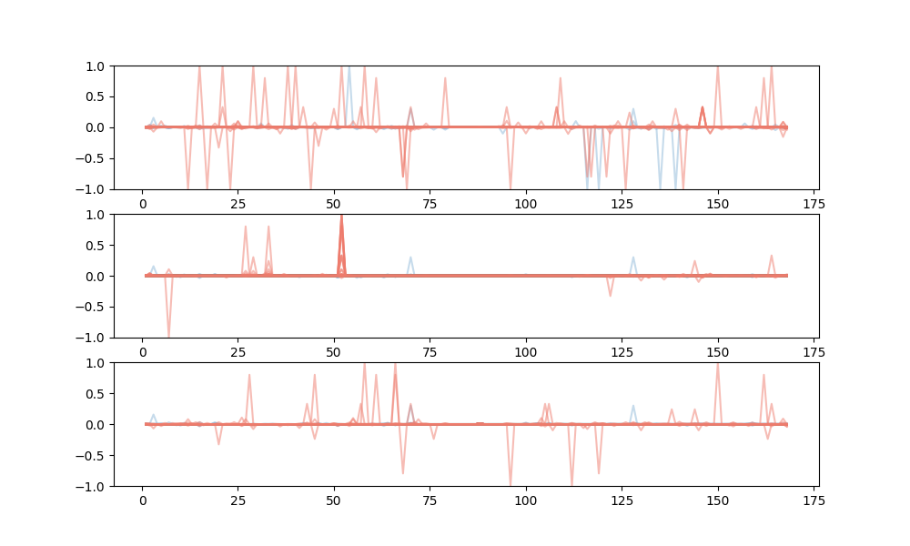

# DeepTFBU: Modeling and designing enhancers with TF binding unit
## 
The code for toolkit implementation of "Modeling and designing enhancers by introducing and harnessing transcription factor binding units"
This toolkit provides the following function:
1. Generating TFBS-context samples from ChIP-seq data. (the folder "0_prepare_training_sample")
2. SigTFBU: Training TFBS-context deep learning model and designing TFBS-context with different score. (the folder "1_HepG2_training_and_gen_TFBU")
3. CSpTFBU: Training cell type-specific TFBS-context model and designing cell type-specific TFBS-context. (the folder "2_specific_enhancer")
4. DeMulTFBU: De novo designing enhancers with multiple TFBSs by multiple-objective optimization. (the folder "3_multi_TF_optimize")
5. ModOptTFBU: Decoupling and optimizing generalized enhancer sequences with TFBUs. (the folder "4_deconv_seq_into_TFBU")
6. Data analysis: Analysing features mentioned in the paper with custom code we developed.

## Contents
1. [Introduction](#introduction)
2. [System Requirements](#system-requirements)
3. [Generating TFBS-context samples from ChIP-seq data](#generate-samples)
4. [SigTFBU: Training TFBS-context model and designing TFBS-context with different score](#train-models)
5. [CSpTFBU: Training cell type-specific TFBS-context model and designing cell type-specific TFBS-context](#specific_enhancer)
6. [DeMulTFBU: De novo designing enhancers with multiple TFBSs by multiple-objective optimization](#multi_TFBSs)
7. [ModOptTFBU: Decoupling and optimizing generalized enhancer sequences with TFBUs](#final_model)
8. [Data analysis: Analysing features mentioned in the paper](#analyse_codes)

## Introduction <a name="introduction">
We introduced the concept of TFBU to quantify the capability of DNA sequences to be bound with TFs thus resulting in high enhancer acitivty. Each TFBU consists of two parts: the core TFBS and the context seuquences surrounding the core TFBS denoted as TFBS-context. 

<div align='center'><br></div>

With the deep learning model of TFBS-context, we realized designing enhancer with TFBU, designing cell type-specific enhancers with TFBU, de novo designing enhancers containing multiple TFBSs and decoupling enhance sequences with TFBSs for the optimization of generalized enhancers. The toolkit provides the corresponding code for the functions above, and users can achieve these functions by executing program in the order according to the prefix.


## System Requirements <a name="system-requirements">

**Hardware requirements:** 

This package requires only a standard computer with enough RAM to support the in-memory operations.

We strongly recommend running this program on a computer with a GPU to accelerate the training of deep learning models, otherwise it will take an extremely long time. 

The reference run time below are measured with CPU: Intel(R) Xeon(R) Gold 6226R CPU @ 2.90GHz

**OS Requirements:** 

The package has been tested on the following system:
- Linux: CentOS 7.8

The function of this package could be achieved with other OS supporting Python and Pytorch.

**Env Requirements:** 

The package has been tested on the following version of env requirements:
- Python 3.8
- PyTorch 1.9.0

Higher version of Python and Pytorch could also support the function of this package.

**Python Dependencies:** 

The function of this package depends on the following Python packages:
    
    numpy
    numba
    pyfaidx
    h5py
    matplotlib
    pandas
    tqdm
    scikit-learn
    Levenshtein

The analysis part requires [MEME suit](https://meme-suite.org/meme/index.html) and these additional Python packages:

    seaborn==0.11
    umap-learn==0.5.4


**Steps of using DeepSEED:** 

1. Install Python ref to [Download Python](https://www.python.org/downloads/)

2. Install PyTorch ref to [Download PyTorch](https://pytorch.org/)

3. Download/Unzip this DeepTFBU project.

4. Install required packages. (There's no need for further installation of softwares) 

    ```
    # make sure you are now in the root directory of DeepTFBU
    pip install -r requirements.txt

    ```

5. Make sure you have downloaded the reference genome file (hg38) and the relative index file (or you can [download](https://hgdownload.soe.ucsc.edu/goldenPath/hg38/bigZips/) it from the UCSC genome browser), and rewrite the directory to the reference genome in the following codes:

    0_prepare_training_sample/0_cal_TF_max_prob.py (line 66)

    0_prepare_training_sample/2_gen_max168_gc_chrstrand_files.py (line 56)

    2_specific_enhancer/0_prepare_data_for_K562/0_cal_TF_max_prob.py (line 66)

    2_specific_enhancer/0_prepare_data_for_K562/2_gen_max168_gc_chrstrand_files.py (line 55)


## Generating TFBS-context samples from ChIP-seq data <a name="generate-samples">
The building of TFBS-context model is based on TFBS-samples derived from the ChIP-seq data. This part shows how to generate TFBS-context samples. Users should execute the programs in '0_prepare_training_sample' in order to the prefix. Here we take the TF GABPA in HepG2 cell line as example. The ChIP-seq data of GABPA in HepG2, the ATAC-seq data and histone modification are required as input. Here we provide the data in 'data_dir' for test.


### 1. Calculate TFBS matching scores in accessible regions
    ```
    cd 0_prepare_training_sample #from the root directory
    python 0_cal_TF_max_prob.py
    ```
This step will generate four files in 'data_dir' with prefix 'step0_'

Reference run time for this step: 8:16, 90% CPU-Util

### 2. Select possible negative samples
    ```
    python 1_selec_negative_samples.py
    ```
This step will generate one file in 'data_dir' named 'step1_HepG2_negative_GATA2.bed'

Reference run time for this step: 0:36, 91% CPU-Util

### 3. Generate TFBS-context with fixed length 168
    ```
    python 2_gen_max168_gc_chrstrand_files.py
    ```
This step will generate two files in 'data_dir' with prefix 'step2_' for candidate positive and negative samples

Reference run time for this step: 6:46, 80% CPU-Util

### 4. Add the histone modification state for the next data selection
    ```
    python 3_cal_and_add_histome.py
    ```
This step will generate two files in 'data_dir' with prefix 'step3_' for candidate positive and negative samples

Reference run time for this step: 5:54, 97% CPU-Util

### 5. Balance positive and negative samples with same GC-context distribution and histone modification state distribution
    ```
    python 4_gen_h5_chrstrand_gc_histome.py
    ```
This step will generate one file in 'data_dir' named 'step4_HepG2_motif_center_seq_mask_168_GATA2_data.h5'

Reference run time for this step: 0:10, 85% CPU-Util


## SigTFBU: Training TFBS-context model and designing TFBS-context with different score <a name="train-models">
This part shows how to train the deep learning modle for TFBS-context and gengerate TFBS-context by genetic algorithm with the guidance of the deep learning model. The TF GABPA is selected as example and when executing the following steps, the previous part should be finished for the '.h5' file containing training samples.

### 1. Train the TFBS-context model
    ```
    cd 1_HepG2_training_and_gen_TFBU #from the root directory
    python 0_train_HepG2_NC_TFBU_model_168bp.py
    ```
This step will create two folder with prefix 'step0_' to store the training result and the weights of deep learning model
The 'denselstm_mc_0.001_mask_168_GATA2_predict_expr_final.png' in 'step0_HepG2_log' should be like: 
<div align='center'><br></div>
There may be a little difference caused by randomness in training. In the paper each model were trained for 10 times

Reference run time for this step: 11:52, 1691% CPU-Util with Nvidia RTX3090 GPU


### 2. Generate TFBS-context with difference score from model with genetic algorithm
    ```
    python 1_HepG2_gen_NC_TFBU_diff_aim.py
    ```
This step will create a folder named 'step1_HepG2_GA_log' to store the log of genetic algorithm

Reference run time for this step: 27:46, 718% CPU-Util with Nvidia RTX3090 GPU


### 3. Select generated TFBS-context with the GC-ratio restriction
    ```
    python 2_HepG2_check_and_selec_gc10_aim.py
    ```
This step will create a folder named 'step2_HepG2_gc10_check' to store the selected TFBS-context with certain GC-ratio. The GC-ratio of selected TFBS-context is limited to 10% above or below the mean GC-ratio of the training sample

Reference run time for this step: 26:50, 88% CPU-Util


### 4. Select TFBS-context with edit distance restriction
    ```
    python 3_HepG2_edit50_check_cut_edit_dist.py
    ```
This step will create a folder named 'step3_HepG2_fasta_edit50' to store the selected TFBS-context with different scores. The Levenshtein distance between the selected TFBS-contex is set >= 50

Reference run time for this step: 0:26, 89% CPU-Util


## CSpTFBU: Training cell type-specific TFBS-context model and designing cell type-specific TFBS-context <a name="specific_enhancer">
This part shows how to train cell type-specific TFBS-context model gengerate cell type-specific TFBS-context by genetic algorithm with the guidance of the deep learning model. Here GABPA is selected as example for generating cell type-specific enhancers. The previous part should be finished for the TFBS-context model in HepG2.

### 1. Prepare K562 TFBS-context data
The ChIP-seq data of GABPA in K562, the ATAC-seq data and histone modification are required as input. Here we provide the data in '2_specific_enhancer/0_prepare_data_for_K562/data_dir' for test.

    ```
    cd 2_specific_enhancer/0_prepare_data_for_K562 #from the root directory
    python 0_train_HepG2_NC_TFBU_model_168bp.py
    python 1_selec_negative_samples.py
    python 2_gen_max168_gc_chrstrand_files.py
    python 3_cal_and_add_histome.py
    python 4_gen_h5_chrstrand_gc_histome.py

    ```

Run the code in this directory in order, the TFBS-context data for GABPA in K562 cell line is generated like part 'Generating TFBS-context samples from ChIP-seq data' and stored in '2_specific_enhancer/0_prepare_data_for_K562/data_dir'

Reference run time for this step: 21:32, 93% CPU-Util


### 2. Prepare TFBS-context for HepG2 vs K562 model
    ```
    cd 2_specific_enhancer/1_prepare_data_for_HepG2_vs_K562 #from the root directory
    python 0_gen_h5_HepG2_vs_K562.py
    ```
Run the code in this directory, the TFBS-context data for HepG2 vs K562 model is generated for the following training and stored in '2_specific_enhancer/1_prepare_data_for_HepG2_vs_K562/data_dir'

Reference run time for this step: 0:11, 77% CPU-Util


### 3. Training K562 TFBS-context model and HepG2 vs K562 model
    ```
    cd 2_specific_enhancer/2_train_models #from the root directory
    python 0_train_K562_NC_TFBU_model_168bp.py
    python 1_train_HepG2_vs_K562_NC_TFBU_model_168bp.py
    ```
Run the two programs above in this directory, the K562 TFBS-context model and the HepG2 vs K562 model are trained.
The 'denselstm_mc_0.001_mask_168_GATA2_predict_expr_final.png' in 'step0_K562_log' should be like: 
<div align='center'><br></div>
The 'denselstm_mc_0.001_mask_168_GATA2_predict_expr_final.png' in 'step1_HepG2_vs_K562_log' should be like: 
<div align='center'><br></div>
There may be a little difference caused by randomness in training. In the paper each model were trained for 10 times

Reference run time for this step: 28:52, 1348% CPU-Util with Nvidia RTX3090 GPU; 19:45, 1200% CPU-Util with Nvidia RTX3090 GPU


### 4. Generating HepG2 specific enhancers
    ```
    cd 2_specific_enhancer/3_gen_HepG2_specific_enhancer #from the root directory
    python 0_HepG2_specific_optimize_masked.py
    python 1_HepG2_specific_check_and_selec_gc10_aim.py
    python 2_HepG2_specific_edit50_check_cut_edit_dist.py
    ```
Run the code in this directory in order, HepG2 specific enhancers are generated like part 'Training TFBS-context model and generate TFBS-context with different score' and stored in '2_specific_enhancer/3_gen_HepG2_specific_enhancer/step2_HepG2_specific_fasta_edit50'

Reference run time for this step: 17:42, 178% CPU-Util with Nvidia RTX3090 GPU


### 5. Generating K562 specific enhancers
    ```
    cd 2_specific_enhancer/4_gen_K562_specific_enhancer #from the root directory
    python 0_K562_specific_optimize_masked.py
    python 1_K562_specific_check_and_selec_gc10_aim.py
    python 2_K562_specific_edit50_check_cut_edit_dist.py
    ```
Run the code in this directory in order, K562 specific enhancers are generated like part 'Training TFBS-context model and generate TFBS-context with different score' and stored in '2_specific_enhancer/4_gen_K562_specific_enhancer/step2_K562_specific_fasta_edit50'

Reference run time for this step: 9:40, 241% CPU-Util with Nvidia RTX3090 GPU


## DeMulTFBU: De novo designing enhancers with multiple TFBSs by multiple-objective optimization <a name="multi_TFBSs">
This part shows how to optimize enhancers with multiple TFBS. Here GABPA is selected as example. The previous part should be finished for the TFBS-context model in HepG2.

### 1. Designing enhancers containing 8 TFBSs
    ```
    cd 3_multi_TF_optimize #from the root directory
    python 0_HepG2_optimize_multimotif.py
    ```
This step will create a folder named 'step0_multimotif_GA_log' to store the log of genetic algorithm

Reference run time for this step: 15:39, 457% CPU-Util with Nvidia RTX3090 GPU


### 2. Designing enhancers containing 4 TFBSs
    ```
    python 1_HepG2_optimize_halfmotif.py
    ```
This step will create a folder named 'step1_halfmotif_GA_log' to store the log of genetic algorithm

Reference run time for this step: 14:22, 322% CPU-Util with Nvidia RTX3090 GPU


### 3. Filtering out enhancers whose interval seuqneces between TFBSs are all the same
    ```
    python 2_multimotif_check_nosamegap.py
    python 3_halfmotif_check_nosamegap.py
    ```
This step will create a folder named 'step2_multimotif_result_norep' and a folder named 'step3_halfmotif_result_norep' to store the selected enhancers

Reference run time for this step: 9:00, 90% CPU-Util; 12:06 92% CPU-Util


### 4. Select enhancers with edit distance restriction
    ```
    python 4_edit_dist_norep.py
    ```
This step will create a folder named 'step4_selceted_result' to store the selected enhancers. The Levenshtein distance between the selected enhancers is set >= 5 for enhancer with 8 TFBSs and set >=10 for enhancer with 4 TFBSs.

Reference run time for this step: less than 1 second


## ModOptTFBU: Decoupling and optimizing generalized enhancer sequences with TFBUs <a name="final_model">
This part shows how to decouple enhancers with TFBUs. The TFBS-context model for 198 TFs in HepG2 are used here and each model is trained for 10 replicates.  The TF list, the PPM matrix and MPRA result should be placed in 'data_dir'. Here we provide the corresponding data in 'data_dir' for test. Since the restriction of file size, the trained weitht of models for 1 replicate can be downloaded from ZENODO with DOI:10.5281/zenodo.10931825 [Download weight](https://zenodo.org/records/10931825) for test. The models' weight should be unzipped and placed in 'all_model_dir'. 


### 1. Generating PPM features
    ```
    cd 4_deconv_seq_into_TFBU #from the root directory
    python 0_gen_PPM_feature.py
    ```
This step will generate one file in 'data_dir' named 'step0_seq_motif_features.pkl'

Reference run time for this step: 40:53, 97% CPU-Util


### 2. Calculate TFBS-context score and generate features
    ```
    python 1_cal_PPM_env_score_L1.py
    ```
This step will generate four file in 'data_dir'  with prefix 'step1_'

Reference run time for this step: 20:45, 1104% CPU-Util with Nvidia RTX3090 GPU


### 3. Modeling enhancers with TFBU features
    ```
    python 2_model_with_TFBU_linear.py
    ```
This step will create one files named 'step2_model_with_TFBU_linear' and train the model with different features for 10 times. The time spent on this step will be relatively longer than other steps
The result plot named 'final_result.png' in 'step2_model_with_TFBU_linear' should be like:
<div align='center'><br></div>

Reference run time for this step: 2:06:40, 90% CPU-Util with Nvidia RTX3090 GPU


### 4. Optimize the CMV enhancer with TFBU-based model
    ```
    python 3_optimize_CMV_enhancer.py
    ```
This step will create a folder named 'step3_optimize_CMV_log' to store the log of optimizing the CMV enhancer. The optimized CMV enhancer with increasing mutations is stored in the file named 'result_log_CMV.txt' in 'step3_optimize_CMV_log'.

Reference run time for this step: 5:31:41, 284% CPU-Util with Nvidia RTX3090 GPU


## Data analysis: Analysing features mentioned in the paper <a name="analyse_codes">
This part provides all the custom code developed for the feature analysis mentioned in the paper, as well as the expected final output after the code is executed. Each folder in code_for_analysis contains a well-organized .py file start with 'analyse_', which can be executed directly in the corresponding directory without any parameters. There is no order requirement for the execution of these feature analysis codes; readers only need to execute the corresponding code according to their own needs.


### 1. Identify obvious TFBS
    ```
    cd code_for_analysis/identify_obvious_TFBS #from the root directory
    python analyse_search_obvious_TFBS.py
    ```
This step will generate seven .tsv files. This step will take a relatively long time to run, and duiring running it will overwrite the results that have been provided, which might be used by other programs. If you start this program, you will need to wait for it to finish before running any other analysis programs.

Reference run time for this step: 7:54:14, 93% CPU-Util


### 2. FOXA2 binding sites features in HNF4A
    ```
    cd code_for_analysis/FOXA2_in_HNF4A #from the root directory
    python analyse_FOXA2_feature.py
    ```
Expected final output:
<div align='center'><br></div>
Reference run time for this step: 0:15.94, 125% CPU-Util


### 3. Generate obvious TFBS feature
    ```
    cd code_for_analysis/obvious_TFBS_feature #from the root directory
    python analyse_obvious_TFBS_feature.py
    ```
Expected final output three .tsv files and following figures:
<div align='center'><br></div>

Reference run time for this step: 5:17.28, 100% CPU-Util


### 4. Generate DNA shape feature
    ```
    cd code_for_analysis/DNAshape_feature #from the root directory
    python analyse_DNAshape_feature.py
    ```
Expected final output three .tsv files and following figures:
<div align='center'><br></div>

Reference run time for this step: 2:50.71, 97% CPU-Util


### 5. Generate weak TFBS feature
    ```
    cd code_for_analysis/weak_TFBS_feature #from the root directory
    python analyse_weak_TFBS_feature.py
    ```
Expected final output:
<div align='center'><br></div>
Reference run time for this step: 0:05.98, 228% CPU-Util


